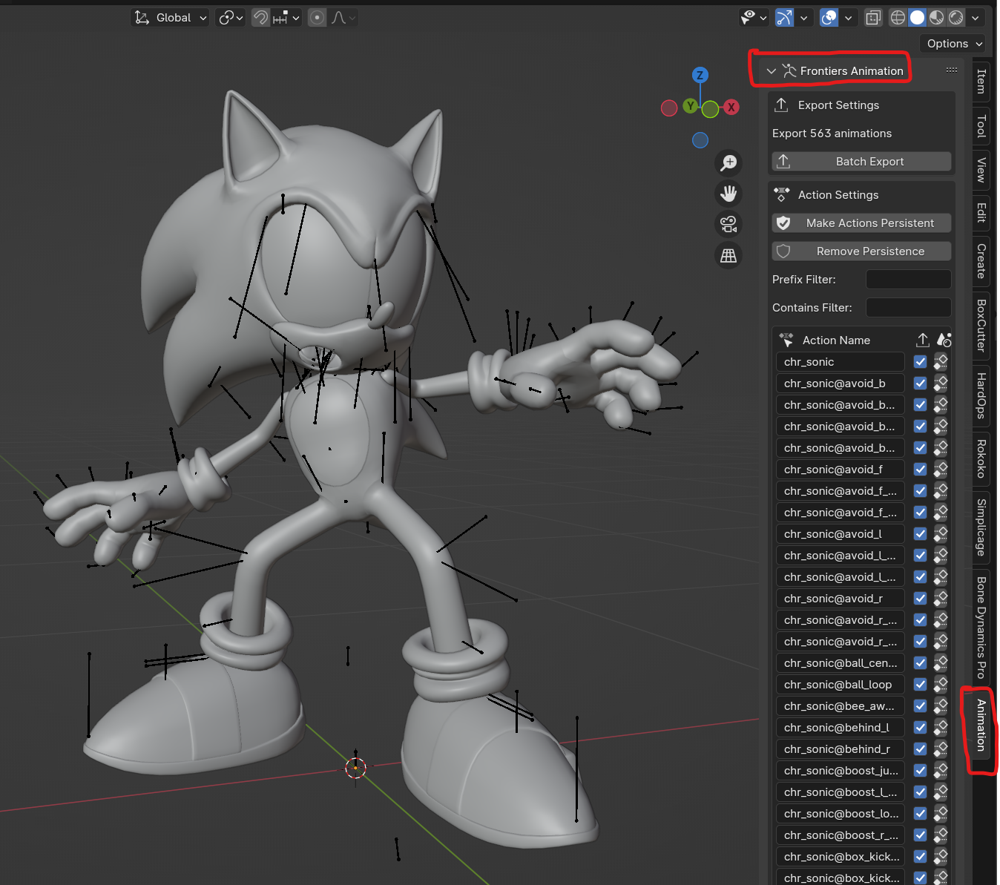
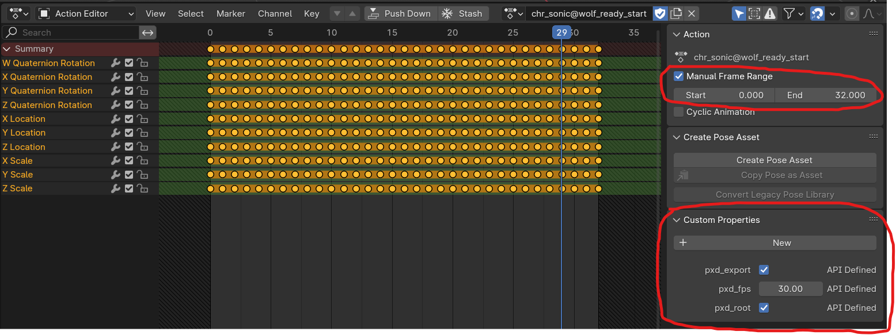
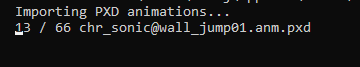

# Frontiers Animation Tools
Blender addon for importing and exporting compressed Hedgehog Engine 2 animations (.anm.pxd)

## Features:
- PXD Skeleton import and export with bone reorientation
- Batch import and export PXD animations as actions
- Per-action FPS and frame range settings
- Visual keying export
- Root motion support as skeleton object transform

## Documentation:
*To-do: make this better*

In the meantime, just a couple notes:

- Batch exporting is found in the 3D viewports side menu under the "Animation" tab.

- A skeleton needs to be selected before importing or exporting an animation.
- Skeletons from ModelFBX outputs may differ from the .skl.pxd files. If you plan to export animations for an unmodified skeleton, consider importing the .skl.pxd file separately to replace the skeleton that came with the ModelFBX output.
- Importing a skeleton with YX orientation will support mirroring in Blender. However, you will need to enable YX reorientation for any and all subsequent skeleton exports, animation imports and exports.
- The skeleton's native orientation should be Y-up (lying on its back in Blender), and then rotated +90deg along X to make it upright with Blender's Z-up space. Root motion imports and exports will base it's transformation off this orientation.
- This tool adds animation keys for every bone for every frame. Having many actions stored in Blender in this manner will make Blender less responsive and use *lots* of memory. Try to keep the total number of actions low and maybe think twice before importing every animation at once. 
- Batch export frame range and FPS settings are pulled from each action's settings in the action editor. These are set when importing an animation and can be changed before exporting.

- When batch exporting, navigate to a folder you want each action to be exported to. Batch exports take the action name and add ".anm.pxd" to the end as the file name. Note that any existing animations in this folder with the same name will be overwritten without warning.
- The UI may freeze while performing large batch operations, and this is unavoidable. It may look like Blender has crashed, but it is working in the background. It's recommended to open the Blender console window before performing a batch operation so you can see the progress of animations being imported/exported even while the UI is frozen (Window > Toggle System Console)

## Credits:
- [WistfulHopes](https://github.com/WistfulHopes): Compression/decompression tool, skeleton export function
- [AdelQue](https://github.com/AdelQue): Animation import and export functions, UI
- [Turk645](https://github.com/Turk645): skeleton import function from [.model importer](https://github.com/Turk645/Hedgehog-Engine-2-Mesh-Blender-Importer)
- [ik-01](https://github.com/ik-01): PXD format spec
- [nfrechette](https://github.com/nfrechette): [acl](https://github.com/nfrechette/acl) and [rtm](https://github.com/nfrechette/rtm) libraries

